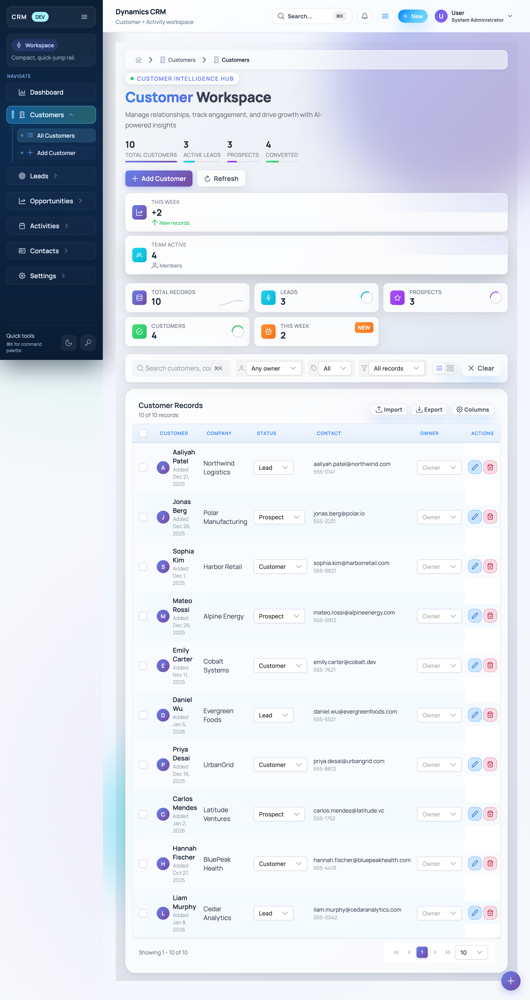

# CRM Enterprise – Copilot Guide

## Monorepo basics
- Angular 21 UI lives in `client/`; Clean Architecture API/Domain/Infrastructure sit in `server/src`.
- Run `npm install` + `npm start` from `client/` for the shell; `npm run build` targets Azure Static Web Apps.
- Backend lives under `server/src/CRM.Enterprise.Api`; use `dotnet build` then `dotnet run --project CRM.Enterprise.Api`.
- `docker compose up -d sqlserver` starts the local SQL Server declared in the root compose file.

-## Frontend workflow

### SCSS Partial Import Guidance
- When importing shared SCSS partials (like _design-tokens.scss) from feature/component stylesheets, always calculate the relative path based on the actual directory depth of the file.
- For features/pages under `crm/features`, use:
  `@use '../../../../../styles/design-tokens' as *;`
- For features/pages under deeper folders (e.g., `packs/supply-chain/features/inventory`), add additional `../` segments as needed. For example:
  `@use '../../../../../../styles/design-tokens' as *;`
- If you encounter a "Can't find stylesheet to import" error, double-check the number of `../` segments so the path resolves from your SCSS file to `src/styles/_design-tokens.scss`.
- This is necessary because Angular CLI does not always support root-relative imports for component-level SCSS, and directory depth may differ between feature areas.
- The shell is entirely standalone-component based (`app.routes.ts` + lazy `loadComponent`); register new views by adding routes beneath `/app`.
- PrimeNG modules are imported per component (see `features/customers/pages/customers.page.ts`); avoid shared NgModules.
- Screens fetch data through thin services in `features/*/services` that build `HttpParams` and call `/api/**` (e.g., `CustomerDataService`).
- State is held with Angular `signal`/`computed` (`CustomersPage`, `DashboardPage`); prefer signals over RxJS subjects in components.
- Tables follow the existing PrimeNG table + paginator composition and status color helpers (`statusSeverity` functions) so reuse that pattern.

## Theme + layout system
- `ThemeService` (`core/theme/theme.service.ts`) sets CSS variables at bootstrap via the `APP_INITIALIZER` in `app.config.ts`.
- When adding palette keys, extend `THEMES` in `core/theme/theme.tokens.ts` and refer to them via CSS variables; do not hardcode colors.
- Global spacing tokens (`--md-space-*`) live in `src/styles.scss`; reference them for padding/margins instead of pixel literals.
- `ShellComponent` owns sidebar/topbar behavior and environment badges; nest feature outlets inside `/app` and keep shell logic isolated there.
- Every page must inherit from the global design system; do not create isolated page styles.
  - Use the shared global files: `src/styles.scss`, `src/styles/_design-tokens.scss`, `src/styles/_components.scss`,
    `src/styles/_animations.scss`, `src/app/shared/_form-page-styles.scss`, `src/app/shared/page-design-system.scss`, `src/app/app.scss`.
- Use PrimeNG `p-inputgroup` + `p-inputgroup-addon` with `pi` icons for form inputs; apply `icon-addon` + specific `icon-addon--*` classes for per-field colors (global rules live in `client/src/styles/_components.scss`).
- Edit/Create form pages must match the **Edit Customer** page standard:
  - Card title styling, card body glass styling, field hover/focus, and primary action button must match.
  - Do not introduce per-page button colors or focus colors.

---

# 🎨 Design System Principles

## Design Philosophy
The CRM uses a **Premium Glass UI** design inspired by Apple + Linear/Vercel hybrid aesthetics:
- **Glassmorphism**: Frosted glass cards with `backdrop-filter: blur()` and subtle transparency
- **Ambient Glow**: Cards lift and glow on hover/focus with blue ambient shadows
- **Gradient Accents**: Purple-to-blue gradients for titles, primary actions, and active states
- **Teal Section Headers**: Form section titles use cyan/teal color palette
- **Smooth Transitions**: All interactions use `cubic-bezier(0.25, 0.46, 0.45, 0.94)` easing
- **Visual Summary Cards**: Hero sections include decorative summary cards (`visual-card`) that provide contextual metrics - this is the **canonical pattern** for all summary/insight cards across the app

## When to Use Which Pattern

| Page Type | Pattern | Example | SCSS Import |
|-----------|---------|---------|-------------|
| **List/Dashboard pages** | Customer Workspace | `customers.page`, `leads.page`, `dashboard.page` | `page-design-system` |
| **Create/Edit forms** | Form Page Style | `role-form.page`, `customer-form.page`, `workspace-settings.page` | `form-page-styles` |
| **Settings pages with forms** | Form Page Style | `workspace-settings.page`, `lead-assignment.page` | `form-page-styles` |

---

## Design Tokens (`_design-tokens.scss`)

Always use design tokens instead of hardcoded values:

### Gradients
```scss
$primary-gradient: linear-gradient(135deg, #667eea 0%, #764ba2 100%);
$success-gradient: linear-gradient(135deg, #4ade80 0%, #22c55e 100%);
$cyan-gradient: linear-gradient(135deg, #22d3ee 0%, #06b6d4 100%);
$purple-gradient: linear-gradient(135deg, #a855f7 0%, #9333ea 100%);
```

### Glassmorphism
```scss
$glass-bg: rgba(255, 255, 255, 0.85);
$glass-bg-subtle: rgba(255, 255, 255, 0.6);
$glass-border: rgba(255, 255, 255, 0.3);
$glass-blur: 20px;
$glass-shadow: 0 8px 32px rgba(0, 0, 0, 0.08), 0 2px 8px rgba(0, 0, 0, 0.04);
$glass-shadow-hover: 0 20px 40px rgba(0, 0, 0, 0.12), 0 8px 16px rgba(0, 0, 0, 0.08);
```

### Spacing & Radius
```scss
$space-1: 0.25rem;  $space-4: 1rem;   $space-6: 1.5rem;  $space-8: 2rem;
$radius-md: 0.5rem; $radius-lg: 0.75rem; $radius-xl: 1rem; $radius-2xl: 1.5rem;
```

### Typography
```scss
$font-size-sm: 0.875rem;   // 14px - hints, labels
$font-size-md: 0.9375rem;  // 15px - body text
$font-size-base: 1rem;     // 16px - default
$font-size-lg: 1.125rem;   // 18px - card titles
$font-size-2xl: 1.375rem;  // 22px - section headers
```

---

## 📐 LIST PAGE DESIGN SPECIFICATION (MANDATORY)

**Reference Implementation:** `customers.page.ts` + `customers.page.scss`  
**Use for:** `customers.page`, `leads.page`, `opportunities.page`, `contacts.page`, `dashboard.page`

### Visual Reference



*The Customers Workspace page showcasing the canonical list page design: gradient background with animated orbs, hero section with stats, visual summary cards, metric KPI cards with ring charts, search/filter toolbar, and glassmorphic data table.*

---

### 1. PAGE CONTAINER & BACKGROUND

```scss
// Page container with gradient background
.page-container {
  position: relative;
  min-height: 100vh;
  padding: $space-5 $space-6;  // 20px 24px
  background: linear-gradient(135deg, #f5f7fa 0%, #e4e9f2 50%, #d8dde8 100%);
  overflow-x: hidden;
  
  @media (max-width: 768px) {
    padding: $space-3;  // 12px
  }
}

// Animated background orbs (fixed position)
.bg-orbs {
  position: fixed;
  inset: 0;
  pointer-events: none;
  z-index: 0;
  overflow: hidden;
}

.orb {
  position: absolute;
  border-radius: 50%;
  filter: blur(60px);
  opacity: 0.4;
  animation: orb-float 20s ease-in-out infinite;
  
  &.orb-1 { width: 600px; height: 600px; background: $primary-gradient; top: -200px; right: -100px; }
  &.orb-2 { width: 400px; height: 400px; background: $cyan-gradient; bottom: 10%; left: -100px; animation-delay: -7s; }
  &.orb-3 { width: 300px; height: 300px; background: $secondary-gradient; top: 40%; right: 20%; animation-delay: -14s; }
}
```

---

### 2. HERO SECTION - TITLE STYLES (MANDATORY SIZES)

```scss
// Hero section: two-column grid layout
.hero-section {
  display: grid;
  grid-template-columns: 1fr auto;
  gap: $space-6;  // 24px
  margin-bottom: $space-5;  // 20px
  animation: fade-in-up 0.6s ease-out;
  
  @media (max-width: 1200px) {
    grid-template-columns: 1fr;
    gap: $space-4;  // 16px
  }
}

// HERO TITLE - "Customer Workspace" main title
.hero-title {
  font-size: $font-size-4xl;  // 32px (2rem)
  font-weight: 800;
  letter-spacing: -0.5px;
  line-height: 1.1;
  margin: 0 0 $space-1;  // 0 0 4px
  
  .title-gradient {
    background: $primary-gradient;  // #667eea → #764ba2
    background-size: 200% auto;
    -webkit-background-clip: text;
    -webkit-text-fill-color: transparent;
    background-clip: text;
    animation: gradient-shift 4s ease-in-out infinite;
  }
  
  .title-light {
    -webkit-text-fill-color: $gray-700;  // #374151
    margin-left: $space-2;  // 8px
  }
}

// Hero badge (e.g., "Customer Intelligence Hub")
.hero-badge {
  display: inline-flex;
  align-items: center;
  gap: $space-2;  // 8px
  padding: $space-1 $space-3;  // 4px 12px
  background: $glass-bg;  // rgba(255, 255, 255, 0.85)
  backdrop-filter: blur(20px);
  border: 1px solid $glass-border;  // rgba(255, 255, 255, 0.3)
  border-radius: $radius-full;  // 9999px (pill shape)
  font-size: $font-size-sm;  // 14px (0.875rem)
  font-weight: 600;
  color: $primary;  // #667eea
  text-transform: uppercase;
  letter-spacing: 0.1em;
  width: fit-content;
  box-shadow: $glass-shadow;
  
  .badge-dot {
    width: 8px;
    height: 8px;
    background: $success;  // #22c55e
    border-radius: 50%;
    animation: pulse-glow 2s ease-in-out infinite;
  }
}

// Hero description text
.hero-description {
  font-size: $font-size-base;  // 16px (1rem)
  color: $gray-500;  // #6b7280
  font-weight: 400;
  max-width: 500px;
  line-height: 1.6;
  margin: 0;
}
```

---

### 3. HERO STATS (INLINE METRICS WITH PROGRESS BARS)

```scss
.hero-stats {
  display: flex;
  gap: $space-4;  // 16px
  flex-wrap: wrap;
  margin-top: $space-2;  // 8px
}

.hero-stat {
  display: flex;
  flex-direction: column;
  gap: 2px;
  min-width: 80px;
  
  .stat-value {
    font-size: $font-size-2xl;  // 22px (1.375rem)
    font-weight: 700;
    color: $gray-800;  // #1f2937
  }
  
  .stat-label {
    font-size: $font-size-xs;  // 13px (0.8125rem)
    color: $gray-500;  // #6b7280
    text-transform: uppercase;
    letter-spacing: 0.05em;
  }
  
  .stat-bar {
    width: 100%;
    height: 4px;
    background: $gray-200;  // #e5e7eb
    border-radius: $radius-full;
    overflow: hidden;
    
    .stat-bar-fill {
      height: 100%;
      background: $primary-gradient;
      border-radius: $radius-full;
      transition: width 1s ease-out;
      
      &--leads { background: $cyan-gradient; }
      &--prospects { background: linear-gradient(135deg, $purple 0%, #9333ea 100%); }
      &--success { background: $success-gradient; }
    }
  }
}
```

---

### 4. VISUAL CARDS (HERO SIDEBAR)

```scss
.hero-visual {
  display: flex;
  flex-direction: column;
  gap: $space-3;  // 12px
  animation: slide-in-right 0.6s ease-out 0.2s both;
}

.visual-card {
  position: relative;
  display: flex;
  align-items: center;
  gap: $space-3;  // 12px
  padding: $space-3 $space-4;  // 12px 16px
  background: $glass-bg;  // rgba(255, 255, 255, 0.85)
  backdrop-filter: blur(20px);
  border: 1px solid $glass-border;
  border-radius: $radius-lg;  // 12px (0.75rem)
  box-shadow: $glass-shadow;
  min-width: 220px;
  overflow: hidden;
  transition: transform 250ms, box-shadow 250ms;
  
  &:hover {
    transform: translateY(-2px);
    box-shadow: $glass-shadow-lg;
  }
  
  .card-icon {
    width: 36px;
    height: 36px;
    display: flex;
    align-items: center;
    justify-content: center;
    border-radius: $radius-md;  // 8px
    font-size: $font-size-xl;  // 20px (1.25rem)
  }
  
  &--primary .card-icon { background: $primary-gradient; color: white; }
  &--secondary .card-icon { background: $cyan-gradient; color: white; }
  &--success .card-icon { background: $success-gradient; color: white; }
  &--purple .card-icon { background: $purple-gradient; color: white; }
  
  .card-label {
    font-size: $font-size-xs;  // 13px
    color: $gray-500;
    text-transform: uppercase;
    letter-spacing: 0.05em;
  }
  
  .card-value {
    font-size: $font-size-2xl;  // 22px (1.375rem)
    font-weight: 700;
    color: $gray-800;
  }
  
  .card-trend {
    display: flex;
    align-items: center;
    gap: $space-1;  // 4px
    font-size: $font-size-xs;  // 13px
    color: $gray-500;
    
    &--up { color: $success; }
  }
  
  .card-glow {
    position: absolute;
    top: -50%;
    right: -50%;
    width: 100%;
    height: 100%;
    background: radial-gradient(circle, rgba(102, 126, 234, 0.15) 0%, transparent 70%);
    pointer-events: none;
  }
}
```

---

### 5. METRIC CARDS (KPI ROW)

```scss
.metrics-section {
  display: grid;
  grid-template-columns: repeat(5, 1fr);
  gap: $space-3;  // 12px
  margin-bottom: $space-5;  // 20px
  
  @media (max-width: 1400px) { grid-template-columns: repeat(3, 1fr); }
  @media (max-width: 900px) { grid-template-columns: repeat(2, 1fr); }
  @media (max-width: 600px) { grid-template-columns: 1fr; }
}

.metric-card {
  position: relative;
  display: flex;
  align-items: center;
  gap: $space-3;  // 12px
  padding: $space-3 $space-4;  // 12px 16px
  background: $glass-bg;
  backdrop-filter: blur(20px);
  border: 1px solid $glass-border;
  border-radius: $radius-lg;  // 12px
  box-shadow: $glass-shadow;
  overflow: hidden;
  transition: all 250ms;
  animation: fade-in-up 0.5s ease-out backwards;
  
  @for $i from 1 through 5 {
    &:nth-child(#{$i}) {
      animation-delay: #{$i * 0.05}s;
    }
  }
  
  &:hover {
    transform: translateY(-2px);
    box-shadow: $glass-shadow-lg;
    
    .metric-icon {
      transform: scale(1.1) rotate(5deg);
    }
  }
  
  .metric-icon {
    width: 36px;
    height: 36px;
    display: flex;
    align-items: center;
    justify-content: center;
    border-radius: $radius-md;  // 8px
    font-size: $font-size-lg;  // 18px
    color: white;
    flex-shrink: 0;
    transition: transform 500ms cubic-bezier(0.34, 1.56, 0.64, 1);
  }
  
  &--total .metric-icon { background: $primary-gradient; }
  &--leads .metric-icon { background: $cyan-gradient; }
  &--prospects .metric-icon { background: linear-gradient(135deg, $purple 0%, #9333ea 100%); }
  &--customers .metric-icon { background: $success-gradient; }
  &--new .metric-icon { background: $orange-gradient; }
  
  .metric-label {
    font-size: $font-size-xs;  // 13px
    color: $gray-500;
    text-transform: uppercase;
    letter-spacing: 0.05em;
  }
  
  .metric-value {
    font-size: $font-size-2xl;  // 22px (1.375rem)
    font-weight: 700;
    color: $gray-800;
  }
}

// Ring chart inside metric card
.metric-ring {
  position: absolute;
  right: $space-3;  // 12px
  top: 50%;
  transform: translateY(-50%);
  width: 32px;
  height: 32px;
  
  svg { width: 100%; height: 100%; transform: rotate(-90deg); }
  .ring-bg { fill: none; stroke: $gray-200; stroke-width: 3; }
  .ring-fill {
    fill: none;
    stroke-width: 3;
    stroke-linecap: round;
    transition: stroke-dasharray 1s ease-out;
    
    &--cyan { stroke: $cyan; }
    &--purple { stroke: $purple; }
    &--green { stroke: $success; }
  }
}

// "NEW" badge pulse
.metric-badge span {
  display: inline-block;
  padding: $space-1 $space-2;  // 4px 8px
  background: $orange-gradient;
  color: white;
  font-size: $font-size-xs;  // 13px
  font-weight: 700;
  border-radius: $radius-sm;  // 6px
  animation: badge-pulse 2s ease-in-out infinite;
}
```

---

### 6. BUTTONS (LIST PAGE ACTIONS)

```scss
.btn {
  position: relative;
  display: inline-flex;
  align-items: center;
  gap: $space-2;  // 8px
  padding: $space-2 $space-4;  // 8px 16px
  border: none;
  border-radius: $radius-md;  // 8px
  font-size: $font-size-base;  // 16px
  font-weight: 600;
  cursor: pointer;
  transition: all 250ms;
  overflow: hidden;
  
  i { font-size: $font-size-base; }
}

.btn-primary {
  background: $primary-gradient;  // #667eea → #764ba2
  color: white;
  box-shadow: 0 4px 14px rgba(102, 126, 234, 0.4);
  
  &:hover {
    transform: translateY(-2px);
    box-shadow: 0 6px 20px rgba(102, 126, 234, 0.5);
  }
  
  &:active { transform: translateY(0); }
}

// Shimmer glow effect on primary button
.btn-glow::before {
  content: '';
  position: absolute;
  inset: 0;
  background: linear-gradient(90deg, transparent, rgba(255, 255, 255, 0.3), transparent);
  animation: shimmer 3s infinite;
}

.btn-secondary {
  background: $glass-bg;
  backdrop-filter: blur(20px);
  border: 1px solid $glass-border;
  color: $gray-700;
  box-shadow: $glass-shadow;
  
  &:hover {
    background: white;
    transform: translateY(-2px);
    box-shadow: $glass-shadow-lg;
  }
}

.btn-ghost {
  background: transparent;
  color: $gray-600;
  
  &:hover {
    background: rgba(0, 0, 0, 0.05);
    color: $gray-800;
  }
}
```

---

### 7. DATA TABLE STYLES (MANDATORY)

```scss
.data-section {
  position: relative;
  z-index: 1;
  animation: fade-in-up 0.5s ease-out 0.4s both;
}

.data-card {
  background: $glass-bg;
  backdrop-filter: blur(20px);
  border: 1px solid $glass-border;
  border-radius: $radius-2xl;  // 24px (1.5rem)
  box-shadow: $glass-shadow;
  overflow: hidden;
}

.data-header {
  display: flex;
  align-items: center;
  justify-content: space-between;
  padding: $space-3 $space-4;  // 12px 16px
  border-bottom: 1px solid rgba(0, 0, 0, 0.06);
  
  h2 {
    margin: 0;
    font-size: $font-size-lg;  // 18px (1.125rem)
    font-weight: 600;
    color: $gray-800;
  }
  
  .record-count {
    font-size: $font-size-sm;  // 14px
    color: $gray-500;
  }
}

.data-table {
  width: 100%;
  border-collapse: collapse;
  border-radius: 16px;
  overflow: hidden;
  
  // TABLE HEADER - Soft blue gradient (GLOBAL STANDARD)
  ::ng-deep .p-datatable-thead > tr > th {
    background: linear-gradient(180deg, #f0f7ff 0%, #e6f0fa 100%);
    border: none;
    border-bottom: 2px solid rgba(59, 130, 246, 0.2);
    padding: $space-3 $space-4;  // 12px 16px
    font-size: 0.72rem;  // ~11.5px (header labels)
    font-weight: 600;
    text-transform: uppercase;
    letter-spacing: 0.08em;
    color: #3b82f6;  // Blue-500
  }
  
  // TABLE BODY CELLS
  ::ng-deep .p-datatable-tbody > tr > td {
    vertical-align: middle;
    padding: $space-3 $space-2;  // 12px 8px
  }
  
  // Row hover effect
  .table-row {
    transition: background 150ms;
    border-bottom: 1px solid rgba(0, 0, 0, 0.04);
    
    &:last-child { border-bottom: none; }
    
    &:hover {
      background: rgba($primary, 0.03);
      
      .customer-avatar {
        transform: scale(1.05);
        box-shadow: 0 4px 12px rgba($primary, 0.2);
      }
    }
  }
}

// Customer avatar in table
.customer-avatar {
  width: 32px;
  height: 32px;
  display: flex;
  align-items: center;
  justify-content: center;
  background: $primary-gradient;
  color: white;
  font-size: $font-size-sm;  // 14px
  font-weight: 600;
  border-radius: 50%;
  flex-shrink: 0;
  transition: all 500ms cubic-bezier(0.34, 1.56, 0.64, 1);
}

// Customer name in table
.customer-info {
  .customer-name {
    font-weight: 600;
    font-size: $font-size-base;  // 16px
    color: $gray-800;
  }
  
  .customer-date {
    font-size: $font-size-xs;  // 13px
    color: $gray-400;
  }
}

// Status badges
.status-badge {
  display: inline-flex;
  padding: 2px $space-2;  // 2px 8px
  font-size: $font-size-sm;  // 14px
  font-weight: 600;
  border-radius: $radius-full;  // pill
  text-transform: capitalize;
  
  &[data-status="lead"] { background: rgba($cyan, 0.15); color: darken($cyan, 15%); }
  &[data-status="prospect"] { background: rgba($purple, 0.15); color: darken($purple, 15%); }
  &[data-status="customer"] { background: rgba($success, 0.15); color: darken($success, 15%); }
  &[data-status="inactive"] { background: rgba($gray-500, 0.15); color: $gray-600; }
}
```

---

### 8. TABLE ACTION BUTTONS

```scss
.icon-btn {
  display: inline-flex;
  align-items: center;
  justify-content: center;
  width: 26px;
  height: 26px;
  background: transparent;
  border: none;
  border-radius: $radius-sm;  // 6px
  color: $gray-400;
  cursor: pointer;
  font-size: $font-size-sm;  // 14px
  transition: all 150ms;
  
  &:hover {
    background: rgba(0, 0, 0, 0.06);
    color: $gray-700;
  }
  
  &--danger:hover {
    background: rgba($danger, 0.1);
    color: $danger;
  }
}

.action-btn {
  display: inline-flex;
  align-items: center;
  gap: $space-1;  // 4px
  padding: $space-1 $space-3;  // 4px 12px
  background: transparent;
  border: 1px solid $gray-200;
  border-radius: $radius-md;  // 8px
  font-size: $font-size-sm;  // 14px
  color: $gray-600;
  cursor: pointer;
  transition: all 150ms;
  
  &:hover {
    background: $gray-50;
    border-color: $gray-300;
    color: $gray-800;
  }
}
```

---

### 9. REQUIRED ANIMATIONS

```scss
@keyframes fade-in-up {
  from { opacity: 0; transform: translateY(20px); }
  to { opacity: 1; transform: translateY(0); }
}

@keyframes slide-in-right {
  from { opacity: 0; transform: translateX(20px); }
  to { opacity: 1; transform: translateX(0); }
}

@keyframes gradient-shift {
  0%, 100% { background-position: 0% 50%; }
  50% { background-position: 100% 50%; }
}

@keyframes pulse-glow {
  0%, 100% { opacity: 1; box-shadow: 0 0 20px rgba(102, 126, 234, 0.4); }
  50% { opacity: 0.8; box-shadow: 0 0 40px rgba(102, 126, 234, 0.6); }
}

@keyframes shimmer {
  0% { transform: translateX(-100%); }
  100% { transform: translateX(100%); }
}

@keyframes orb-float {
  0%, 100% { transform: translate(0, 0) scale(1); }
  25% { transform: translate(50px, -30px) scale(1.1); }
  50% { transform: translate(100px, 20px) scale(0.9); }
  75% { transform: translate(30px, 50px) scale(1.05); }
}

@keyframes badge-pulse {
  0%, 100% { transform: scale(1); }
  50% { transform: scale(1.1); }
}
```

---

### 10. QUICK SIZE REFERENCE TABLE

| Element | Font Size | Padding/Size | Notes |
|---------|-----------|--------------|-------|
| Hero Title (`.hero-title`) | 32px (`$font-size-4xl`) | - | Bold 800, gradient text |
| Hero Title Light (`.title-light`) | 32px | `margin-left: 8px` | Gray-700 color |
| Hero Badge | 14px (`$font-size-sm`) | `4px 12px` | Uppercase, letter-spacing 0.1em |
| Hero Description | 16px (`$font-size-base`) | - | Gray-500, max-width 500px |
| Stat Value | 22px (`$font-size-2xl`) | - | Bold 700 |
| Stat Label | 13px (`$font-size-xs`) | - | Uppercase, letter-spacing 0.05em |
| Visual Card | - | `12px 16px` | Min-width 220px |
| Visual Card Icon | 20px (`$font-size-xl`) | `36px × 36px` | Border-radius 8px |
| Visual Card Value | 22px (`$font-size-2xl`) | - | Bold 700 |
| Metric Card | - | `12px 16px` | Border-radius 12px |
| Metric Card Icon | 18px (`$font-size-lg`) | `36px × 36px` | Border-radius 8px |
| Metric Card Value | 22px (`$font-size-2xl`) | - | Bold 700 |
| Button (`.btn`) | 16px (`$font-size-base`) | `8px 16px` | Bold 600, border-radius 8px |
| Table Header | ~11.5px (`0.72rem`) | `12px 16px` | Uppercase, letter-spacing 0.08em |
| Table Cell | 16px (`$font-size-base`) | `12px 8px` | - |
| Customer Avatar | 14px (`$font-size-sm`) | `32px × 32px` | Circular |
| Status Badge | 14px (`$font-size-sm`) | `2px 8px` | Pill shape |
| Icon Button | 14px (`$font-size-sm`) | `26px × 26px` | Border-radius 6px |

---

### 11. SCSS IMPORT PATTERN

```scss
// customers.page.scss (or any list page)
@use '../../../../../styles/design-tokens' as *;
@use 'sass:color';

// All styles from this specification...
```

---

## Visual Summary Cards (Decorative Cards)

**Design Principle**: Visual summary cards provide at-a-glance insights in the hero section sidebar. They are the **canonical pattern** for decorative summary cards across all pages.

### Purpose
- Display contextual metrics or status at the top of any page
- Provide visual balance to the hero section
- Show real-time or computed values with trend indicators
- Must be meaningful to the page context (not just decoration)

### Required Structure
```html
<div class="hero-visual">
  <div class="visual-card visual-card--primary">
    <div class="card-icon">
      <i class="pi pi-chart-line"></i>
    </div>
    <div class="card-content">
      <span class="card-label">This Week</span>
      <strong class="card-value">+{{ value }}</strong>
      <span class="card-trend card-trend--up">
        <i class="pi pi-arrow-up"></i> Trend text
      </span>
    </div>
    <div class="card-glow"></div>
  </div>
</div>
```

### Visual Card Variants
| Variant | Use Case | Background Gradient |
|---------|----------|---------------------|
| `--primary` | Main metric, new records, growth | Purple → Blue |
| `--secondary` | Team/user counts, secondary info | Blue → Cyan |
| `--success` | Completed items, wins, conversions | Green gradient |
| `--purple` | Special/featured metrics | Deep purple |

### Key Design Elements
- **Card glow**: `.card-glow` adds ambient lighting effect on hover
- **Card icon**: 44px rounded container with gradient background, scales on hover
- **Card trend**: Shows direction (up/down arrow) with contextual text
- **Hover effect**: `translateY(-3px) scale(1.01)` + gradient border glow

### Content Guidelines
- **Label**: Short descriptor (max 2 words) - "This Week", "Team Active", "Pipeline"
- **Value**: Primary metric, can include prefix (+, $, %) - keep concise
- **Trend**: Contextual descriptor - "New records", "Members", "vs last month"

### When to Use
- List/Dashboard pages: Show metrics relevant to the data being displayed
- Settings pages: Show configuration summary or status
- Form pages with hero: Show related counts or status

---

## Metric Cards (KPI Dashboard Cards)

**Design Principle**: Metric cards display key performance indicators in a horizontal dashboard row. They are the **canonical pattern** for KPI visualization across all list/dashboard pages.

### Purpose
- Display key metrics below the hero section
- Show real-time counts with visual progress indicators
- Provide quick data insights with sparklines or ring charts
- Animate on load with staggered fade-in-up effect

### Required Structure
```html
<section class="metrics-section">
  <div class="metric-card metric-card--total">
    <div class="metric-icon">
      <i class="pi pi-database"></i>
    </div>
    <div class="metric-content">
      <span class="metric-label">Total Records</span>
      <strong class="metric-value">{{ count }}</strong>
    </div>
    <div class="metric-ring">
      <svg viewBox="0 0 36 36">
        <path class="ring-bg" d="M18 2.0845 a 15.9155 15.9155 0 0 1 0 31.831 a 15.9155 15.9155 0 0 1 0 -31.831"/>
        <path class="ring-fill ring-fill--cyan" [attr.stroke-dasharray]="percentage + ', 100'" d="M18 2.0845 a 15.9155 15.9155 0 0 1 0 31.831 a 15.9155 15.9155 0 0 1 0 -31.831"/>
      </svg>
    </div>
  </div>
</section>
```

### Metric Card Variants
| Variant | Use Case | Icon Gradient |
|---------|----------|---------------|
| `--total` | Total count, all records | Purple → Blue (`$primary-gradient`) |
| `--leads` | Leads count | Cyan → Teal (`$cyan-gradient`) |
| `--prospects` | Prospects | Purple (`$purple-gradient`) |
| `--customers` | Converted customers | Green (`$success-gradient`) |
| `--new` | New this week/period | Orange (`$orange-gradient`) |

### Key Design Elements
- **Card size**: `padding: $space-3 $space-4` (0.75rem 1rem)
- **Icon size**: 36px × 36px rounded container with gradient background
- **Hover effect**: `translateY(-2px)` + `$glass-shadow-lg`, icon scales 1.1 and rotates 5deg
- **Staggered animation**: Each card animates with 0.05s delay (`animation-delay: #{$i * 0.05}s`)
- **Ring chart**: 32px circular SVG progress indicator (right side)
- **Badge**: Optional "NEW" badge with `$orange-gradient` and pulse animation

### Ring Fill Colors
```scss
.ring-fill--cyan { stroke: $cyan; }    // #06b6d4
.ring-fill--purple { stroke: $purple; } // #a855f7  
.ring-fill--green { stroke: $success; } // #22c55e
```

### Responsive Grid
```scss
.metrics-section {
  display: grid;
  grid-template-columns: repeat(5, 1fr);  // 5 cards
  gap: $space-3;
  
  @media (max-width: 1400px) { grid-template-columns: repeat(3, 1fr); }
  @media (max-width: 900px) { grid-template-columns: repeat(2, 1fr); }
  @media (max-width: 600px) { grid-template-columns: 1fr; }
}
```

### When to Use
- List pages (Customers, Leads, Opportunities, Contacts)
- Dashboard pages with key metrics
- Settings pages with configuration stats
- Any page needing KPI visualization row

---

## Form Page Pattern (Create/Edit/Settings Pages)

Use for: `role-form.page`, `customer-form.page`, `lead-form.page`, `workspace-settings.page`

### Key Features
- **Glass cards that lift on hover**: `translateY(-3px) scale(1.005)` + blue ambient glow
- **Focus-within effect**: When any input is focused, entire card gets `80px` blue glow
- **Gradient border**: Rainbow gradient appears on card hover via `::before` pseudo-element
- **Section title animation**: Icon scales up + enhanced shadow on card hover
- **Premium input focus**: `4px` blue ring + soft glow around focused inputs

### SCSS Setup
```scss
@use '../../../../shared/form-page-styles' as form;
@use '../../../../../styles/design-tokens' as *;

:host {
  @include form.premium-selection;
  @include form.premium-focus-ring;
}

.page-container {
  @include form.form-page-base;  // Mesh gradient + animated orbs
}
```

### Form Card with Focus Pop Effect
```scss
.form-card {
  @include form.form-section;  // Glass card with hover/focus effects
  
  &:hover .section-title {
    @include form.section-title-hover;  // Title animates on hover
  }
}

.section-title {
  @include form.section-title;  // Teal icon + title styling
}
```

### HTML Structure
```html
<section class="form-page">
  <header class="form-header">
    <div class="header-content">
      <app-breadcrumbs></app-breadcrumbs>
      <button class="back-link" routerLink="/app/...">
        <i class="pi pi-arrow-left"></i> Back
      </button>
      <div class="header-title">
        <h1>
          <span class="title-gradient">Create</span>
          <span class="title-light">Role</span>
        </h1>
        <p>Description text</p>
      </div>
    </div>
  </header>

  <div class="form-body">
    <form class="form-layout">
      <!-- Glass card that pops on focus -->
      <section class="form-card">
        <h3 class="section-title">
          <i class="pi pi-id-card"></i>
          Section Name
        </h3>
        <div class="form-grid">
          <div class="field">
            <label>Label <span class="required">*</span></label>
            <input pInputText formControlName="name" />
          </div>
        </div>
      </section>
    </form>
  </div>
</section>
```

### Mandatory Select Rules
- **Every `<p-select>` MUST render icons for each option.**
- Always include `pTemplate="item"` + `pTemplate="value"` with icon + label.
- Always show a placeholder inside the value template when empty.
- Icons must be colorful (no black/white). Add color mappings in `client/src/styles.scss` when introducing new icons.

Example pattern:
```html
<p-select [options]="statusOptions()" optionLabel="label" optionValue="value" formControlName="status">
  <ng-template pTemplate="item" let-option>
    <div class="select-option">
      <i class="pi" [ngClass]="option.icon"></i>
      <span>{{ option.label }}</span>
    </div>
  </ng-template>
  <ng-template pTemplate="value" let-option>
    <div class="select-option" *ngIf="option">
      <i class="pi" [ngClass]="option.icon"></i>
      <span>{{ option.label }}</span>
    </div>
    <span *ngIf="!option" class="select-placeholder">Select status</span>
  </ng-template>
</p-select>
```

### Available Mixins (`_form-page-styles.scss`)

| Mixin | Purpose |
|-------|---------|
| `form.form-page-base` | Mesh gradient background + animated orbs |
| `form.form-page-header` | Sticky frosted header bar |
| `form.form-header-title` | Gradient title + description styling |
| `form.form-back-link` | Blue animated back button |
| `form.form-section` | **Glass card with hover lift + focus glow** |
| `form.section-title` | Teal icon + title with border |
| `form.section-title-hover` | Title animation on card hover |
| `form.form-grid` | 2-column responsive grid |
| `form.form-field` | Field container with gap |
| `form.form-label` | Label styling |
| `form.premium-input` | Glass input base styling |
| `form.premium-input-hover` | Input hover state |
| `form.premium-input-focus` | **Blue focus ring + glow** |
| `form.button-primary` | Gradient primary button |
| `form.button-ghost` | Transparent ghost button |
| `form.form-actions` | Right-aligned action buttons |

### Section Icon Variants
```scss
.section-icon {
  // Default: teal/cyan
  &--info { /* blue */ }
  &--warning { /* amber */ }
  &--success { /* green */ }
}
```

---

## Color Palette Reference

### Primary Actions & Gradients
- **Primary gradient**: `#667eea → #764ba2` (purple-violet)
- **Title gradient**: Same as primary, with `animation: gradient-shift 4s`

### Section Headers (Form Pages)
- **Icon background**: `rgba(6, 182, 212, 0.15)` (teal)
- **Icon color**: `#06b6d4` (cyan-500)
- **Title color**: `#0e7490` (cyan-700)
- **Border**: `rgba(6, 182, 212, 0.2)`

### Focus States
- **Input focus ring**: `rgba(0, 122, 255, 0.15)` (Apple blue)
- **Card focus glow**: `rgba(0, 122, 255, 0.08)` 80px spread

### Status Colors
- **Success**: `#22c55e` / `#10b981`
- **Warning**: `#f59e0b` / `#f97316`
- **Info**: `#0ea5e9` / `#3b82f6`
- **Danger**: `#ef4444`

---

## Animation Patterns

### Card Hover (Form Pages)
```scss
&:hover {
  transform: translateY(-3px) scale(1.005);
  box-shadow: 
    0 24px 48px rgba(0, 122, 255, 0.08),
    0 0 60px rgba(0, 122, 255, 0.06);
}
```

### Focus-Within Glow
```scss
&:focus-within {
  transform: translateY(-2px);
  box-shadow: 
    0 12px 32px rgba(0, 122, 255, 0.1),
    0 0 80px rgba(0, 122, 255, 0.08);
}
```

### Gradient Border on Hover
```scss
&::before {
  background: linear-gradient(135deg, 
    rgba(0, 122, 255, 0.4) 0%,
    rgba(175, 82, 222, 0.3) 50%,
    rgba(90, 200, 250, 0.4) 100%);
}
```

### Title Gradient Animation
```scss
@keyframes gradient-shift {
  0%, 100% { background-position: 0% 50%; }
  50% { background-position: 100% 50%; }
}
```

---

## Mock API layer
- Dev builds default to `environment.useMockApi = true`, so `/api/**` is intercepted by `mocks/mock-api.interceptor.ts`.
- To expose new mock endpoints, add handlers in the interceptor and data in `mock-db.ts`; keep payloads aligned with the future REST contracts.
- When pointing at the real API, flip `useMockApi` (or override via env files) so Angular uses `HttpClient` against `environment.apiUrl`.

---

# 🏗️ Backend Clean Architecture (MANDATORY)

## Architecture Overview
The backend **strictly follows Clean Architecture** with four layers. **All new features MUST follow this pattern.**

```
┌─────────────────────────────────────────────────────────────────┐
│                     CRM.Enterprise.Api                          │
│  Controllers, Contracts (DTOs), Middleware, Authorization       │
│  - Thin controllers that delegate to Application services       │
│  - NEVER inject DbContext directly into controllers             │
└─────────────────────────────────────────────────────────────────┘
                              │
                              ▼
┌─────────────────────────────────────────────────────────────────┐
│                  CRM.Enterprise.Application                     │
│  Interfaces (IXxxService), DTOs, Business Logic Contracts       │
│  - Define service interfaces here                               │
│  - Define request/response DTOs here                            │
│  - NO database access, NO infrastructure concerns               │
└─────────────────────────────────────────────────────────────────┘
                              │
                              ▼
┌─────────────────────────────────────────────────────────────────┐
│                   CRM.Enterprise.Domain                         │
│  Entities, Enums, Value Objects, Domain Events                  │
│  - Pure domain models with no dependencies                      │
│  - Business rules and invariants                                │
└─────────────────────────────────────────────────────────────────┘
                              │
                              ▼
┌─────────────────────────────────────────────────────────────────┐
│                CRM.Enterprise.Infrastructure                    │
│  Service Implementations, Repositories, DbContext, External APIs│
│  - Implements Application interfaces                            │
│  - Database access via CrmDbContext                             │
│  - Register services in DependencyInjection.cs                  │
└─────────────────────────────────────────────────────────────────┘
```

## Layer Responsibilities

### Domain Layer (`CRM.Enterprise.Domain`)
- **Contains**: Entities, Enums, Value Objects, Domain Events
- **Dependencies**: None (innermost layer)
- **Location**: `server/src/CRM.Enterprise.Domain/`
```
Domain/
├── Entities/
│   └── Supplier.cs           # Entity with properties only
├── Enums/
│   └── SupplierStatus.cs     # Status enumerations
└── Common/
    └── AuditableEntity.cs    # Base classes
```

### Application Layer (`CRM.Enterprise.Application`)
- **Contains**: Service interfaces, DTOs, business logic contracts
- **Dependencies**: Domain only
- **Location**: `server/src/CRM.Enterprise.Application/`
```
Application/
├── Suppliers/
│   ├── ISupplierService.cs       # Interface definition
│   ├── SupplierDto.cs            # Data transfer objects
│   └── SupplierSearchRequest.cs  # Request models
└── DependencyInjection.cs        # Register application services
```

### Infrastructure Layer (`CRM.Enterprise.Infrastructure`)
- **Contains**: Service implementations, repositories, DbContext, external integrations
- **Dependencies**: Application, Domain
- **Location**: `server/src/CRM.Enterprise.Infrastructure/`
```
Infrastructure/
├── Suppliers/
│   └── SupplierService.cs    # Implements ISupplierService
├── Persistence/
│   └── CrmDbContext.cs       # EF Core DbContext
└── DependencyInjection.cs    # Register infrastructure services
```

### Api Layer (`CRM.Enterprise.Api`)
- **Contains**: Controllers, API Contracts (request/response records), Middleware
- **Dependencies**: Application (via interfaces only)
- **Location**: `server/src/CRM.Enterprise.Api/`
```
Api/
├── Controllers/
│   └── SuppliersController.cs    # Thin controller, delegates to ISupplierService
├── Contracts/
│   └── Suppliers/
│       ├── SupplierListItem.cs   # API response records
│       └── UpsertSupplierRequest.cs
└── Middleware/
```

## ⚠️ STRICT RULES

1. **Controllers MUST NOT inject DbContext directly**
   - ❌ `public SuppliersController(CrmDbContext dbContext)`
   - ✅ `public SuppliersController(ISupplierService supplierService)`

2. **Business logic MUST live in Application/Infrastructure, NOT Controllers**
   - Controllers should only: validate input, call service, return response

3. **Every new feature requires all 4 layers**:
   - Domain: Entity (if new)
   - Application: `IXxxService` interface + DTOs
   - Infrastructure: `XxxService` implementation
   - Api: Controller + Contracts

4. **Register services properly**:
   - Application services: `AddApplication()` in `Application/DependencyInjection.cs`
   - Infrastructure services: `AddInfrastructure()` in `Infrastructure/DependencyInjection.cs`

## Example: Adding a New Feature

To add a new "Suppliers" feature:

```csharp
// 1. Domain/Entities/Supplier.cs (if not exists)
public class Supplier : AuditableEntity { ... }

// 2. Application/Suppliers/ISupplierService.cs
public interface ISupplierService
{
    Task<SupplierSearchResponse> SearchAsync(SupplierSearchRequest request, CancellationToken ct);
    Task<SupplierDto?> GetByIdAsync(Guid id, CancellationToken ct);
    Task<SupplierDto> CreateAsync(CreateSupplierRequest request, CancellationToken ct);
    Task<SupplierDto?> UpdateAsync(Guid id, UpdateSupplierRequest request, CancellationToken ct);
    Task<bool> DeleteAsync(Guid id, CancellationToken ct);
}

// 3. Infrastructure/Suppliers/SupplierService.cs
public class SupplierService : ISupplierService
{
    private readonly CrmDbContext _dbContext;
    public SupplierService(CrmDbContext dbContext) => _dbContext = dbContext;
    // ... implement interface methods
}

// 4. Infrastructure/DependencyInjection.cs
services.AddScoped<ISupplierService, SupplierService>();

// 5. Api/Controllers/SuppliersController.cs
[ApiController]
public class SuppliersController : ControllerBase
{
    private readonly ISupplierService _supplierService;
    public SuppliersController(ISupplierService supplierService) => _supplierService = supplierService;
    // ... thin controller methods that delegate to service
}
```

---

## Backend workflow
- `Program.cs` wires `AddApplication()` + `AddInfrastructure()` and enforces CORS for localhost:4200/5173; update those lists if the client origin changes.
- Controllers return record DTOs under `Api/Contracts/**`; keep DTO definitions colocated with their controller namespace.
- **Controllers MUST delegate to Application layer services** - see Clean Architecture section above.
- Auth flows go through `AuthController` + `IAuthService`; tokens are issued in `Infrastructure/Auth/AuthService` using `JwtOptions` from configuration.

## Persistence + seeding
- `CrmDbContext` applies `ApplyConfigurationsFromAssembly` and stamps audit columns in `SaveChanges`; set `CreatedAtUtc/UpdatedAtUtc` via this hook, not manually.
- `DatabaseInitializer` runs on startup (see `Program.cs` scope) to apply migrations, seed roles, seed the admin user, and add canonical lead/opportunity stages.
- Update the connection string + JWT secrets in `CRM.Enterprise.Api/appsettings.Development.json`; identical names are required in Azure app settings later.

## Feature development checklist
- Decide whether the UI should hit the mock layer or backend; update both the Angular service and, if mocking, the interceptor/data so UX stays functional offline.
- For backend additions, add contracts → controller → domain/infrastructure pieces, then register services in `AddApplication`/`AddInfrastructure` as needed.
- Whenever endpoints touch the DB, mirror the DTO in Angular (models/service) so shapes stay in sync; rely on the PrimeNG patterns already in `features/*/pages`.
- Keep tests aligned with existing tooling (`ng test` / Vitest when configured) and prefer integration tests at the API layer once DbContext mappings solidify.
